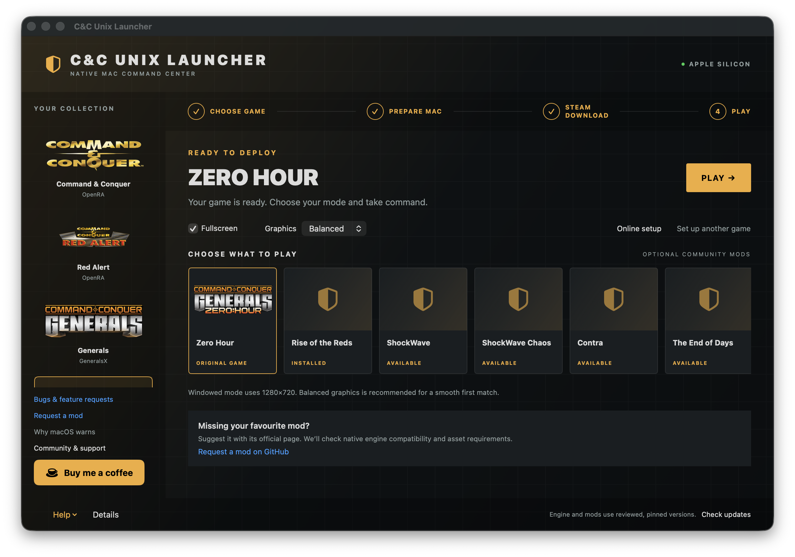
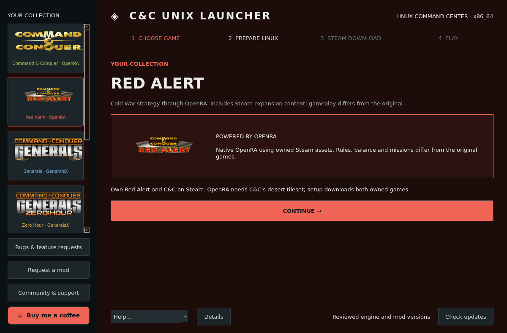

# C&C Unix Launcher

**Play supported Command & Conquer games on Mac and Linux with a guided setup.**

One day I was helping a nontechnical friend get Command & Conquer running so we
could play together. Between finding the right community projects, troubleshooting
Wine and figuring out mod installation, there was a lot to work through before
we could even play. So I figured I’d vibecode a launcher to make setup easier for
my friend, and share it in case it helps others too.

C&C Unix Launcher brings that setup into one app. Choose a supported game, follow
the Steam sign-in steps, select a mod if you want one, and press Play. The launcher
handles engine and runtime downloads, file verification, separate mod profiles,
and common setup fixes. You do not need to build an engine or assemble game and
mod folders by hand.

Some steps still need you: signing in to Steam in its local console, approving
macOS’s first-open prompt, or allowing Linux dependency installation. The goal is
to take most routine technical work off your hands, while keeping those approvals
and credentials under your control.

The current catalog covers C&C/Tiberian Dawn and Red Alert through OpenRA,
Generals and Zero Hour through GeneralsX, and experimental Wine profiles for
Red Alert 2, Yuri’s Revenge and Tiberian Sun/Firestorm. C&C 3 and other additional
3D titles are deferred. macOS uses SwiftUI; Linux has a separate Qt/PySide6 UI
with the same guided flow.

Years of work by engine developers, mod teams and open-source maintainers make
this possible. This launcher makes their work easier to install and use; the
engines, compatibility tools and mods belong to their creators.

[Support the launcher on Ko-fi](https://ko-fi.com/ricklemore). Also consider
supporting the projects and maintainers that make this launcher possible:

- [GeneralsX / fbraz3 — GitHub Sponsors](https://github.com/sponsors/fbraz3).
- Gcenx’s macOS Wine builds — [Ko-fi](https://ko-fi.com/gcenx) or [PayPal](https://paypal.me/gcenx).
- [OpenRA hosting — Patreon](https://www.patreon.com/orahosting).

See the [community credits and support links](docs/community.md) for the projects,
their contributors and the sources of these donation links. Support is optional;
the launcher stays free and open source.

**Community preview.** Installer, readiness, credential-guidance and security
checks pass, and Zero Hour and Red Alert 2 have been played on the development Mac.
Fresh-machine setup, live Linux gameplay and the full game/mod catalog still need
broader testing. Wine profiles remain experimental. See [verification.md](docs/verification.md)
for the evidence and remaining checks.

**[Download for Apple Silicon Mac](https://github.com/RickWoltheus/cnc-unix-launcher/releases/download/v0.3.0/CnC-Unix-Launcher-macOS-arm64.zip)** · **[Download for Linux x86_64](https://github.com/RickWoltheus/cnc-unix-launcher/releases/download/v0.3.0/CnC-Unix-Launcher-linux-x86_64.tar.gz)**

## Screenshots

**macOS — choose the original game or a curated mod, then use one Play button.**



**Linux — the same guided setup with game selection and a themed sidebar.**



The Linux screenshot is an offscreen capture of the real interface in a fresh
setup state. Screenshots show the launcher, not proof that every game has been tested.

## Downloads and security

Every custom engine/mod download, including cache hits, must match a pinned SHA-256
before installation. SteamCMD comes from Valve’s HTTPS CDN; Valve handles its later
updates. Some Generals mod data uses a community HTTP mirror with pinned hashes.
Hashes verify expected bytes; they do not certify malware-free software.

**Help → Security & downloads** offers optional local ClamAV scanning before
installation. Set up ClamAV and its definitions there, then enable the checkbox.
No file upload is performed. Missing/stale definitions, scanner errors, threats and
reported incomplete scans stop installation. Previously detected hashes stay blocked.
You can also scan cached downloads and inspect local reports. ClamAV is optional;
normal setup still checks download hashes.

See [sources, security review and scanner limits](docs/security.md). This project
cannot guarantee the safety of every third-party dependency.

## Requirements

- Apple Silicon Mac with macOS 15 or later.
- The selected game owned on your Steam account. The Ultimate Collection
  includes it. **The Remastered Collection does not.**
- About 8 GB free per game and up to 8 GB per optional mod. Allow 40 GB to install everything.
- Internet access and your Steam password/Steam Guard. Enter credentials only in
  the local SteamCMD Terminal window.

End users do not need Homebrew, Xcode, a compiler, CrossOver, or a VM. SteamCMD
requires Apple's free Rosetta. OpenRA and GeneralsX run natively as ARM64;
Wine games also use Rosetta and are not native ports.

**Linux preview:** x86_64 Ubuntu 24.04+ / Debian 12+ desktops with Vulkan-capable drivers
and glibc 2.36 or newer. Intel Macs, macOS 14 and ARM Linux are not supported by these packages.
The Linux archive bundles Python and Qt. Generals engines use upstream Flatpak
bundles; OpenRA uses extracted AppImages with its runtime included. Prepare Linux guides installation of Flatpak and SteamCMD's 32-bit
dependencies in a local terminal. See [Linux setup and validation](docs/linux.md).
Linux headless/offscreen checks have passed; real desktop, sign-in, Flatpak
sandbox and GPU/gameplay tests remain pending.

## Install and play on macOS

For the current community preview:

1. Download [CnC-Unix-Launcher-macOS-arm64.zip](https://github.com/RickWoltheus/cnc-unix-launcher/releases/download/v0.3.0/CnC-Unix-Launcher-macOS-arm64.zip).
2. Extract it, and move **C&C Unix Launcher.app** to Applications.
3. Open the app. For the unnotarized preview, use **System Settings → Privacy &
   Security → Open Anyway** after the first blocked launch. You can alternatively
   remove quarantine from the app you downloaded:

   ```sh
   xattr -dr com.apple.quarantine "/Applications/C&C Unix Launcher.app"
   ```

4. Choose a game in the sidebar and click **Continue**. C&C and Red Alert use
   OpenRA with modernized gameplay; Generals and Zero Hour use GeneralsX.
   Red Alert 2, Yuri’s Revenge and Tiberian Sun / Firestorm use experimental Wine
   compatibility profiles; see [their setup and limitations](docs/compatibility-games.md).
5. Click **Prepare my Mac**. The launcher installs the selected engine or Wine runtime and Steam downloader.
6. Click **Sign in to Steam**. A separate **Steam setup guide** opens beside
   Terminal and follows the password, Steam Guard, download and validation steps.
   Enter credentials only in Valve’s local console. The guide does not store
   passwords/codes or display raw Steam output. Let validation finish, then continue
   to Play. Use **Help → Show Steam guide** to reopen it; closing it does not stop Steam.
7. Select **Zero Hour** or a mod in **Choose what to play**. The one big **Play**
   button always launches your highlighted selection. For a new mod it becomes
   **Install & Play**, with a download confirmation first.

The app pins GeneralsX 1.0.2, OpenRA release-20250330 and the mod versions below. Installing the engine
again repairs it; it does not silently upgrade to an untested upstream version.
SteamCMD updates itself using Valve's normal bootstrap.

## Install and play on Linux

Extract `CnC-Unix-Launcher-linux-x86_64.tar.gz` and run:

```sh
bash ./CnCUnixLauncher/start-launcher.sh
```

The startup script checks desktop libraries before opening the UI and offers
installation on Ubuntu/Debian. Follow the same four-step setup. If your Linux tools are missing, the launcher
opens a terminal for package installation and then continues engine preparation.
Enter administrator and Steam passwords only in their respective local terminals.
Vulkan drivers must be installed through the host distribution.

## Bugs and feature requests

Use [GitHub Issues](https://github.com/RickWoltheus/cnc-unix-launcher/issues)
or **Bugs & feature requests** in the launcher. Include your OS version, CPU/GPU,
launcher version, selected game/mod and steps to reproduce. Share relevant error
messages after removing personal information; never post Steam credentials or game assets.

The four-step setup checks prerequisites before unlocking Steam or Play. Existing
verified installations can skip completed steps. Steam sign-in guidance updates
for password errors, Steam Guard, expired codes, rate limits, missing ownership,
connection errors and interrupted downloads. Only a status label reaches the GUI;
credentials stay in Valve's local client. See [issue-handling.md](docs/issue-handling.md).

The mod cards load promotional thumbnails from URLs in the publisher-linked
GenLauncher catalog. Images are fetched at runtime, with placeholders offline;
they are not bundled in this repository or release. Each mod links to its page
for artwork credit and more information.

Sidebar game logos load from the selected game's official Steam artwork CDN.
The logos belong to their respective owners, are not bundled in the release,
and fall back to text emblems when artwork is unavailable.

## Classic games

C&C and Red Alert use owned English Ultimate Collection assets through OpenRA.
OpenRA changes rules, balance and missions; it is not the original Windows game.
Red Alert setup also downloads your owned C&C copy for the required desert tileset.
These integrations passed synthetic import checks; real Steam asset/gameplay tests
remain pending. See [classic game setup](docs/classic-games.md).

## Native classic mods

C&C offers **Combined Arms 1.09** and **Tiberian Dawn HD playtest-20260222**;
Red Alert offers Combined Arms. Each uses its own pinned OpenRA runtime and
isolated profile. Select the mod and use the single Install & Play button.

Combined Arms uses owned C&C and Red Alert Steam assets. Tiberian Dawn HD needs
**Remastered Collection (Steam 1213210)** in addition to the base setup; Ultimate
Collection does not provide its HD artwork. Allow up to 40 GB for that download.
If source assets are missing, the launcher opens the local SteamCMD guide and
finishes setup after validation. No EA asset mirror is used. These are curated
options, not a measured popularity ranking. Gameplay remains experimental.

Use **Request a mod** in the sidebar or game page to open a prefilled GitHub issue.
Include the publisher's page and desired platform; never attach game assets.

## Online play

**Online setup** checks the selected local engine/assets/mod files. OpenRA clients
already include public-server multiplayer; GeneralsX includes GeneralsOnline/NGMP.
Accounts, browser approval and OS firewall prompts remain user actions. Friends
need compatible engine and mod versions, including on Windows.

OpenRA hosting can explicitly enable UPnP/NAT-PMP discovery through the setup
window. The launcher only writes local settings; it never changes a router or
firewall itself. Joining public servers does not require that option. Local
preparation does not prove NAT reachability or a working multiplayer match.

## Why the Mac preview is not Apple-verified

This volunteer project has a **€0 budget**. Developer ID signing and notarization
require Apple's paid Developer Program, including for apps distributed outside
the App Store. We currently have no funds for membership, so macOS may block the
first launch. Apple publishes [US$99 per year with local pricing](https://developer.apple.com/programs/enroll/).
App Store distribution is optional; this launcher does not need to be in it.

After a blocked launch, use **System Settings → Privacy & Security → Open Anyway**
for C&C Unix Launcher if you trust the download. The same explanation is under
**Why macOS warns** in the app. Ko-fi support is optional; the launcher stays free.

## Mods and updates

| Mod | Pinned version |
| --- | --- |
| Rise of the Reds | 1.87 Public Build 2.0 |
| ShockWave | 1.201 GenLauncher Fix 1 |
| ShockWave Chaos | 49 |
| Contra | 10.0.2 Beta 2 Patch 1 |
| The End of Days | 0.98.6 Patch 11 |

These are well-known mods, not a measured popularity ranking. Their installation,
repeat-install, checksum and launch-argument checks passed headlessly. Gameplay
compatibility is **experimental**. The installer excludes Windows binaries,
font replacements, backups, optional mod videos and duplicated EA movie files.
Mods requiring Windows engine patches can have missing features under GeneralsX.

**Check for updates** checks this repository's GitHub releases and links to a
newer launcher ZIP. For this preview, download it, quit the launcher and games,
and replace the app. Game data remains outside the app. Self-replacement is not
automatic. Engine/mod upgrades come through reviewed launcher releases and their
pinned manifests; rerun engine installation or mod installation after updating.
Repeating **Download Steam game** runs Steam's own update and validation.

## Files and privacy

The rename preserves existing preferences and data. The managed installation still
uses `~/Library/Application Support/GeneralsX Launcher/` on Mac so existing games
are found automatically:

```text
engine/          GeneralsX app and bundled runtime libraries
engine-base/     Base Generals engine and runtime
steamcmd/        Valve's downloader
Generals/        Your Steam base Generals installation
GeneralsZH/      Your Steam game installation
RiseOfTheReds/   Separate game installation with ROTR archives
mods/            Other separate mod installations
downloads/      Verified download cache
logs/           Game launch logs
```

No EA game assets, mod archives, engine binaries, credentials, or user saves are
included in this repository or its launcher archive. Downloads go directly to
each user's machine. Steam authentication runs in SteamCMD; this app never
reads the password or Steam Guard code. Valve may cache authentication locally
using its own client behavior. The launcher adds no analytics.

GeneralsX stores settings and saves in its upstream user-data folder,
`~/Library/Application Support/GeneralsX/GeneralsZH/`. All Zero Hour mod profiles
share that folder. Base Generals uses the sibling `Generals` user-data folder.
Name mod saves clearly and load them only with the matching mod.
Maximum graphics backs up `Options.ini` as `Options.before-launcher.ini` before
changing it. Turning off the launcher's checkbox stops applying the preset; it
does not reset already saved options. Change those in the game or restore the
backup while the game is closed.

Balanced graphics uses high detail with 2× anti-aliasing and 8× anisotropic
filtering. Maximum uses 8× anti-aliasing and 16× filtering. Both preserve unrelated
options and the original backup. Use Help to repair the engine or selected mod.

## Download verification

The engine ZIP and SteamCMD bootstrap must match pinned SHA-256 hashes before
extraction. Valve's bootstrap URL can change; an unexpected update stops the
installation until the checksum is reviewed and updated here.

Mods come from the public mirrors listed in the GenLauncher catalog. These
mirrors serve HTTP. Every mod data file must match a SHA-256 recorded from the
previously installed files. Those pins prevent changed downloads from being
accepted, but are **not publisher signatures** and do not establish independent
authenticity of the original mirror contents. The launcher asks for consent
before this optional download and never runs the mod's Windows executables.

Failed installs preserve the previous engine or mod folder. Re-running setup
reuses checksum-verified downloads. Downloads can take several minutes.

## Troubleshooting

- **No subscription:** Steam accepted the login but did not find the required
  license. Check the account and Zero Hour ownership. No extra subscription is
  required when you purchased the game.
- **Rosetta required:** review Apple's installation agreement in Terminal.
- **Checksum mismatch:** do not bypass the check. The upstream file changed or
  the transfer was corrupted; retry or wait for a reviewed manifest update.
- **Pink textures or missing voices:** repeat the Steam download with validation.
  The Steam `ZH_Generals` directory contains shared base-game files.
- **Already running:** quit the current match normally before switching profiles
  or changing graphics settings.
- **Installer lock after interruption:** confirm no installer or Steam download
  is running, then remove `.install-lock` in the installation folder and retry.
- **Low FPS:** turn off applying maximum graphics and lower quality/resolution
  in the game. 8× anti-aliasing at Retina resolution can be expensive.
- **Launch failure:** open the installation folder and inspect `logs/vanilla.log`
  or `logs/rotr.log`.

## Build from source

Install Xcode or Apple's command line tools, then:

```sh
xcode-select --install
bash scripts/build.sh
```

Output: `dist/C&C Unix Launcher.app` and
`dist/CnC-Unix-Launcher-macOS-arm64.zip`. The app is ad-hoc signed and is not
notarized. No Apple Developer subscription is needed to build it locally.

The UI is SwiftUI; the installer uses macOS's Bash, curl, ditto, tar, and shasum.
Both the app and command-line workflow call the same backend:

```sh
bash scripts/backend.sh engine
bash scripts/backend.sh engine base
bash scripts/backend.sh steam
bash scripts/backend.sh steam-login
bash scripts/backend.sh steam-login base
bash scripts/backend.sh rotr
bash scripts/backend.sh mod shockwave
bash scripts/backend.sh launch vanilla -fullscreen -xres 1920 -yres 1080
bash scripts/backend.sh launch base -win -xres 1280 -yres 720
```

Tests use dummy launchers by default. Never start real games unless the person
using the machine explicitly asks for a game launch or an end-to-end game test.

For Linux builds and offscreen tests, use the commands in [docs/linux.md](docs/linux.md).
`CLAUDE.md` requires behavior changes to update both native frontends. Installation,
checksums, mod activation, Steam status parsing, setup prerequisites and guidance
resources are shared; platform adapters contain the OS-specific commands.

## Credits and license

See the [community credits and support links](docs/community.md) for the engine,
mod, compatibility and tooling projects, their contributor/team pages, the
launcher’s contributors and published maintainer donation links. The same credits
and support links are available from **Community & support** in both launchers; the
coffee button’s tooltip explains their work and this launcher’s role.

This launcher's original code is licensed under the [MIT License](LICENSE).
Third-party components, derived files, artwork and game data keep their own
licenses and ownership; see [third-party notices](THIRD-PARTY-NOTICES.md). This is an independent community launcher,
not an official EA, Valve, engine or mod-team product. No upstream maintainer’s
endorsement is implied.
